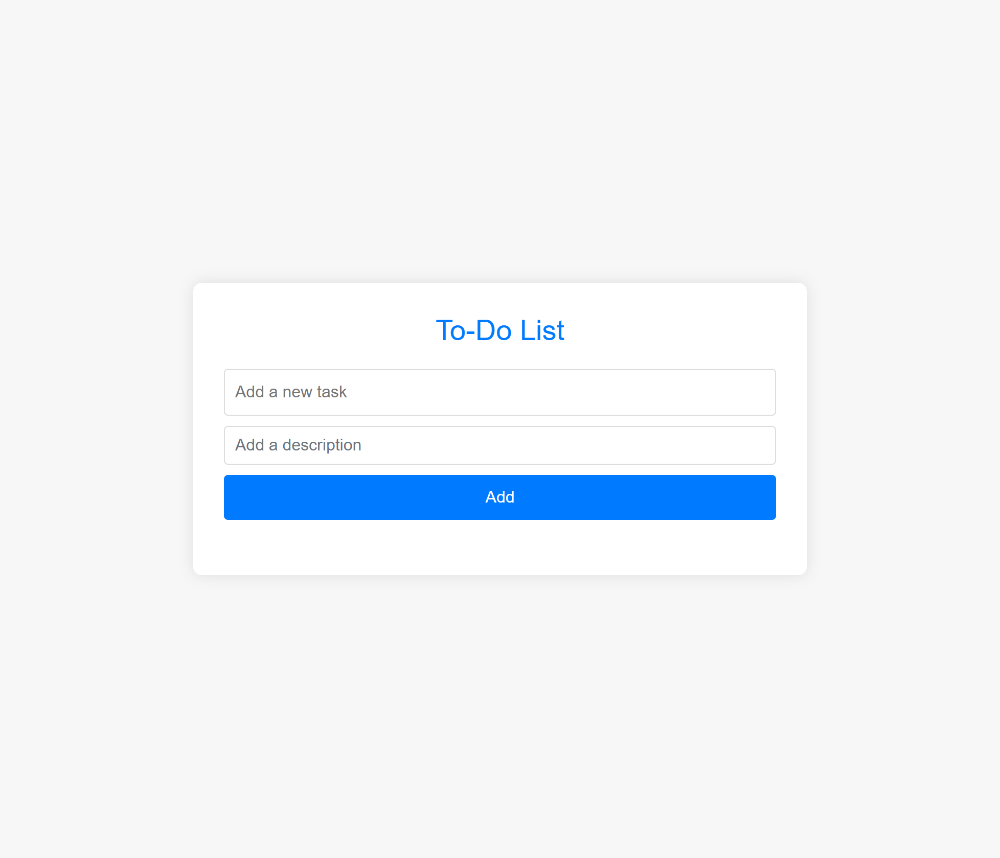
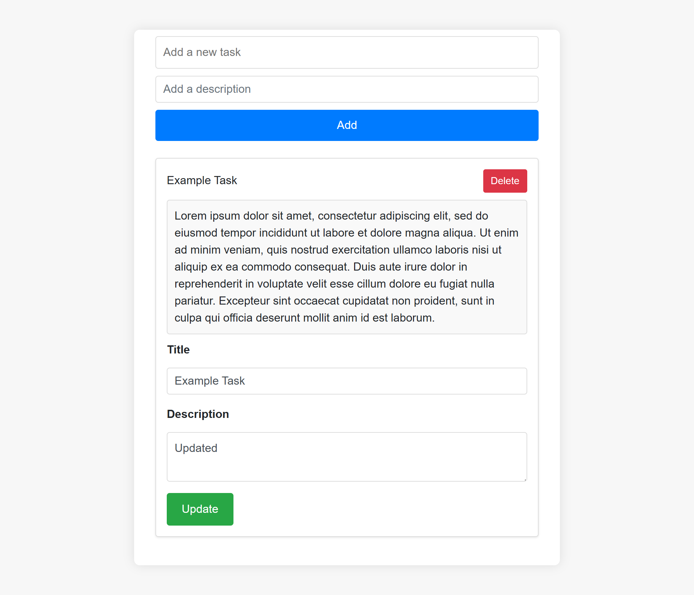

# Laravel To-Do List

A simple To-Do List application built with Laravel. This project demonstrates basic CRUD (Create, Read, Update, Delete) operations in a Laravel application with a user-friendly interface.

## Table of Contents

- [Features](#features)
- [Installation](#installation)
- [Usage](#usage)
- [Routes](#routes)
- [Screenshots](#screenshots)
- [Contributing](#contributing)
- [License](#license)

## Features

- Add new tasks with descriptions
- Update existing tasks
- Delete tasks
- View all tasks with descriptions
- Scroll to the top of the page after adding or updating a task for better UX

## Installation

Follow these steps to set up the project locally:

1. **Clone the repository:**

    ```bash
    git clone https://github.com/SmoothCriminal163/to-do-list-php.git
    cd to-do-list-php
    ```

2. **Install dependencies:**

    ```bash
    composer install
    npm install
    npm run dev
    ```

3. **Set up the environment:**

   Copy the `.env.example` file to `.env` and update the database credentials.

    ```bash
    cp .env.example .env
    php artisan key:generate
    ```

4. **Run the migrations:**

    ```bash
    php artisan migrate
    ```

5. **Start the development server:**

    ```bash
    php artisan serve
    ```

## Usage

- Visit `http://localhost:8000` to view the application.
- Use the form at the top of the page to add new tasks.
- Each task can be updated or deleted using the respective buttons.

## Routes

The application has the following routes:

- `GET /` - Display all tasks.
- `POST /create-task` - Create a new task.
- `PUT /update-task/{id}` - Update an existing task.
- `DELETE /delete-task/{id}` - Delete a task.

## Screenshots

### Home Page

*This is the initial view of the application where you can add new tasks.*

### Home Page with Error

*An error message is displayed if you try to add a task without a title.*

### Home Page with Example Data

*Here you can see the list of tasks added to the application.*

### Home Page with Example Data Inserted

*Shows a new task that has been added to the list.*

### Home Page Updating Description

*Shows the interface for updating the description of an existing task.*

### Home Page with Updated Description

*Displays the updated description of an existing task.*

## Contributing

Contributions are welcome! Please follow these steps:

1. Fork the repository.
2. Create a new branch: `git checkout -b feature/your-feature-name`.
3. Make your changes and commit them: `git commit -m 'Add some feature'`.
4. Push to the branch: `git push origin feature/your-feature-name`.
5. Submit a pull request.

## License

This project is licensed under the MIT License.
